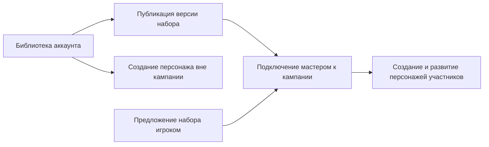

# Личная библиотека, контент кампаний и создание персонажей

**GEN-CONTENT-01 — новый проектный пункт.** Предложение от 06.10.2026,
подготовлено по коду `master` на коммите `25ae5c9`. Файл плана:
[account-campaign-content-design.md](../roadmap/tasks/account-campaign-content-design.md).

Документ описывает будущую логику. Программная реализация, изменение API и миграции
не входят в эту задачу. Соответствующий ранее утверждённый пункт `ROT-*` / `GEN-*`:
**Not found in current codebase**. Новый ID введён только для отслеживания предложения.

## Подтверждённые требования

- Пользователь создаёт кастомный контент на уровне своего аккаунта.
- Этот контент можно подключать к кампаниям.
- Участники используют подключённый контент при создании персонажей.
- Персонаж может быть создан вне кампании или сразу внутри кампании.
- Мастер может подключить к своей кампании собственный контент.
- **Ответ пользователя от 06.10.2026:** внутри кампании личный контент игрока доступен
  только после разрешения мастера.

Все последующие решения — предложения. `Assumption` отмечает не согласованные
дополнительно ограничения и варианты жизненного цикла.

## Что уже есть в коде

| Возможность | Текущее поведение и источник |
| --- | --- |
| Владение контентом | `OwnerUserId` у definition: null — встроенный, иначе пользовательский. Например, [SkillDef](../backend/src/GenesysForge.Domain/Entities/SkillDef.cs). |
| Личные наборы | [HomebrewPack](../backend/src/GenesysForge.Domain/Entities/HomebrewPack.cs) принадлежит аккаунту; есть импорт, экспорт, импорт копии по ссылке и включение по умолчанию. |
| Подключение к кампании | [SetCampaignHomebrewPackHandler](../backend/src/GenesysForge.Application/Features/HomebrewPacks/HomebrewPackHandlers.cs) позволяет мастеру подключить собственный пакет. |
| Создание кастома | [CustomContentEndpoints](../backend/src/GenesysForge.Api/Endpoints/CustomContentEndpoints.cs) привязан к campaign route; [CampaignCustomContent](../backend/src/GenesysForge.Application/Features/CustomContent/CampaignCustomContent.cs) разрешает создание только мастеру и создаёт/использует служебный пакет кампании. |
| Видимость в кампании | [HomebrewVisibility](../backend/src/GenesysForge.Application/Common/HomebrewVisibility.cs) добавляет пакеты кампании к личным; для персонажа объединяет пакеты всех связанных кампаний. |
| Создание персонажа | [CreateCharacterRequest](../backend/src/GenesysForge.Application/Dtos/CreateCharacterRequest.cs) не содержит CampaignId; [CreateCharacterHandler](../backend/src/GenesysForge.Application/Features/Characters/CreateCharacterHandler.cs) допускает собственные custom archetype/career/skills, но не чужие через кампанию. |
| Участие в кампании | [JoinCampaignHandler](../backend/src/GenesysForge.Application/Features/Campaigns/JoinCampaignHandler.cs) требует существующего собственного персонажа; [CampaignMapper](../backend/src/GenesysForge.Application/Features/Campaigns/CampaignMapper.cs) проверяет участие через CampaignCharacter. |
| Развитие персонажа | [BuyTalentHandler](../backend/src/GenesysForge.Application/Features/Characters/BuyTalentHandler.cs) и [BuySkillRankHandler](../backend/src/GenesysForge.Application/Features/Characters/BuySkillRankHandler.cs) уже учитывают пакеты кампаний через HomebrewVisibility. |
| Редактирование | Например, [UpdateCustomTalentHandler](../backend/src/GenesysForge.Application/Features/CustomContent/UpdateCustomTalentHandler.cs) меняет существующую definition на месте, включая механические параметры. |
| Интерфейс | [CustomTab](../frontend/src/components/CustomTab.tsx) требует campaignId; [CharactersPage](../frontend/src/pages/CharactersPage.tsx) создаёт персонажа без контекста кампании. |

Отдельное членство аккаунта без персонажа, публикация неизменяемых версий пакетов и
запрос игрока на подключение своего пакета: **Not found in current codebase**.
Кампании сейчас не имеют поля игровой системы; нельзя предполагать, что оно уже есть.

Главные разрывы: игроку нужен персонаж для доступа к материалам, которые нужны ему
для создания персонажа; личный контент остаётся доступен внутри кампании автоматически;
пакеты разных кампаний смешиваются; правка исходной definition может менять чужие листы.

## Предлагаемая логика

Разделить три отношения: **владение**, **разрешение кампании** и **использование персонажем**.
Автор владеет библиотекой. Мастер определяет доступный контент конкретной кампании.
Игрок владеет персонажем и использует разрешённые определения.

### Личная библиотека

Любой пользователь получает раздел «Моя библиотека»: навыки, таланты, предметы,
архетипы, карьеры и героические способности. Создание не требует кампании или роли мастера.
Героические способности сохраняют ограничение системы Realms of Terrinoth.

Повторно использовать HomebrewPack как набор контента аккаунта. В интерфейсе наборы
служат группировкой: например, «Морская кампания». Для одиночной записи можно автоматически
создать личный набор, чтобы пользователь не проходил отдельный обязательный шаг.
В первой реализации подключается целый набор; выбор отдельных записей возможен
через отдельный набор. Одновременное членство definition в нескольких наборах не требуется.

Редактор библиотеки показывает весь собственный контент, включая отключённый для игры.
Игровой справочник показывает только разрешённый в текущем контексте. Поэтому список
для управления библиотекой должен быть отдельным от GetReferenceHandler.

### Кампания и участие аккаунта

Игрок вводит код приглашения и вступает **аккаунтом**. Персонаж на этом шаге необязателен.
После вступления доступны разрешённый контент, «Создать персонажа» и «Добавить существующего».
Удаление последнего персонажа из кампании не удаляет членство аккаунта.

Добавить CampaignMember с уникальной парой CampaignId/UserId. CampaignCharacter оставить
для связи персонажа и кампании. Campaign.GmUserId остаётся источником полномочий мастера;
членство игрока само по себе не даёт права мастера. Роль относится к конкретной кампании:
один аккаунт может вести одну кампанию и играть в другой.

Обновить проверки доступа во всех campaign use cases и SignalR, списки кампаний,
выход/исключение пользователя и доступ к листам участников. Выход из кампании отзывает
доступ аккаунта, включая действующее соединение с группой SignalR. Удаление связи
персонажа и выход аккаунта становятся разными действиями.

### Подключение контента

Мастер открывает «Контент кампании» и подключает опубликованную версию собственного
набора из библиотеки. Один набор можно подключать к нескольким кампаниям. Владелец
исходного контента сохраняется; участникам не требуется импортировать личные копии.

Игрок может предложить свою опубликованную версию мастеру. Предложение фиксирует
согласие автора на просмотр и использование этой версии в указанной кампании.
Мастер принимает или отклоняет предложение; принятие создаёт подключение. Знание
чужого PackId не позволяет просмотреть приватную библиотеку или подключить её.

**Assumption:** разрешение выдаётся всей кампании на набор, а не одному персонажу.
Участники видят подключённый набор и его автора; изменять источник может только автор.
Мастер управляет подключением чужого набора, но не редактирует его. Если нужна собственная
редакция, явное копирование создаёт новый принадлежащий мастеру набор с происхождением.

### Два режима персонажа

| Действие | Вне кампании | Внутри кампании |
| --- | --- | --- |
| Создание | Встроенный контент выбранной системы + выбранные личные наборы | Встроенный контент выбранной системы + версии наборов, подключённые мастером |
| Личный кастом игрока | Доступен по выбору владельца | Доступен только через подключение мастером |
| Кастом другой кампании | Не становится личным автоматически | Не доступен через членство в другой кампании |
| Новый навык, талант, предмет или героика | Проверка личного контекста | Проверка контекста кампании на сервере |
| Владение персонажем | Создавший пользователь | Создавший пользователь |

Для создания внутри кампании передавать CampaignId, проверить членство, собрать контент
этой кампании и проверить все выбранные definitions и их зависимости. Создание персонажа
и CampaignCharacter выполняется атомарно. Подмена CampaignId, устаревший выбор или
ошибка любой проверки не должны оставлять персонажа, снаряжение, XP или связь частично.

Получение справочника и мутации должны использовать один сервис ContentAccessPolicy.
Для существующего персонажа сервер определяет контекст по сохранённой привязке;
произвольный query/body context не может расширить разрешения. Проверка «принадлежит
этому игроку» заменяется проверкой «разрешён этому персонажу» только для выбора контента,
а ownership самого персонажа и право редактировать definitions сохраняются.

**Assumption для первой реализации:** у персонажа один активный контекст правил —
личный либо одна кампания. Сохранить его явно, например как Character.RulesCampaignId.
Это исключает текущее объединение пакетов разных кампаний. Если нужен тот же герой
с разными правилами в двух играх, первая версия предлагает создать копию. Существующие
связи с несколькими кампаниями не удалять; выбор активного контекста для таких legacy
персонажей требует отдельного явного решения, без автоматического назначения.

### Добавление существующего персонажа

Владелец выбирает персонажа, сервер показывает проверку совместимости: использованные
архетип, карьера, навыки, таланты, героика, предметы и связанные зависимости относительно
наборов кампании. Членство пользователя не подключает автоматически его личную библиотеку.

**Assumption:** если персонаж использует неразрешённый контент, подключение персонажа
ожидает разрешения мастера; текущий личный персонаж сохраняется. Мастер может подключить
нужную версию набора либо отклонить запрос. Без конфликтов владелец завершает добавление
сразу. После принятия сервер сохраняет контекст кампании и связь атомарно. Уже существующую
активную кампанию персонажа нельзя переключить только подменой параметра запроса.

## Обновления, отключение и сохранность листов

**Assumption / рекомендуемый вариант:** подключать неизменяемую опубликованную версию.
Редактирование библиотеки создаёт новую версию, которую мастер принимает явно.
Другие кампании продолжают использовать выбранные ими версии. Подключение опубликованной
версии не делает приватные черновики или последующие версии автора доступными участникам.

При обновлении доступны две разные операции: разрешить новую версию для будущих
выборов и обновить уже использованный контент конкретных персонажей. Вторая требует
предварительного отчёта изменений, участия владельца персонажа и мастера, атомарной
проверки XP, пирамиды, рангов и производных характеристик. Не заменять старые IDs
по совпадению имени и не пересчитывать существующие листы незаметно.

При отключении набора, удалении кампании или выходе участника:

- Ранее выбранный контент и его механические параметры сохраняются в листе как
  закреплённые определения/снимки, с указанием источника и версии.
- Ранее выданные карьерные и стартовые навыки тоже сохраняются как часть происхождения.
- Новые покупки, новые ранги и выдача новых экземпляров предмета из отключённого набора
  запрещены, если нет независимого действующего разрешения в текущем контексте.
- Использование уже имеющегося навыка, таланта, предмета или героики продолжается.
  Refund и снятие экипировки проверяются по сохранённым правилам и текущим ограничениям.
- Это право относится к конкретному листу и не открывает полный набор или создание
  других персонажей с ним. После выхода личный режим также не импортирует библиотеку мастера.
- Архивирование источника скрывает его из новых выборов. Физическое удаление не должно
  каскадно удалять используемые definitions или менять персонажей.

Если versioning слишком велик для первого релиза, допустим упрощённый вариант:
запретить изменение используемых/подключённых definitions и делать новую редакцию явной
копией набора. Это всё равно должно обеспечивать сохранность старых листов. Прямое
редактирование общих definitions на месте не обеспечивает предложенные гарантии.

## Зависимости и идентичность

Публикация и подключение проверяют не только сам набор: кастомная карьера может ссылаться
на кастомный навык, стартовое снаряжение — на предмет, талант — на другие определения.
Все зависимости должны быть встроенными разрешённой системы, входить в публикуемую
версию или ссылаться на явно закреплённые и разрешённые версии других наборов.
Отсутствующая зависимость блокирует операцию с понятной причиной и без частичных записей.

Использовать стабильные IDs/ключи с происхождением и версией; одинаковое имя двух авторов
не означает одну запись. В коде часть ссылок на навыки пока задана именами, например
[CustomCareerValidator](../backend/src/GenesysForge.Application/Features/CustomContent/CustomCareerValidator.cs).
Новые связи между наборами нельзя строить только на имени: нужен явный mapping и
совместимый переход для существующих career/species references.

## Что менять при реализации

| Область | Предлагаемое изменение |
| --- | --- |
| Существующие сущности | Переиспользовать HomebrewPack, HomebrewPackCampaign и HomebrewPackCharacter; сохранить ownership и существующие character IDs. |
| Членство | Добавить CampaignMember и перенести авторизацию аккаунтов с CampaignCharacter на членство/полномочия мастера. |
| Версии | Добавить публикацию и закрепление версии набора с неизменяемыми typed definitions или снимками; конкретную схему выбрать при реализации. |
| Подключение | Связь кампании с разрешённой версией, автор/подключивший, включение; предложение игрока с явным согласием автора и решением мастера. |
| Персонаж | Явный контекст правил и сохранённые определения используемого контента. |
| Application | Один ContentAccessPolicy для reference, создания, покупок, назначения героики и проверки зависимостей; владение отделено от права использования. |
| API | Личный CRUD, создание набора, публикация, вступление без персонажа, предложения/подключения и создание/добавление персонажа с контекстом. |
| Frontend | «Моя библиотека»; в кампании — «Разрешённый контент», предложение мастеру, создание и добавление персонажа; маркировка источника в выборе и листе. |

Предлагаемые формы API для обсуждения, **не существующий контракт**:

- Личная библиотека: `/api/v1/homebrew-packs` и `/api/v1/custom/{type}` с явно выбранным набором.
- Вступление аккаунтом: отдельный membership use case по коду; старый join с CharacterId
  сохранить как совместимый сценарий, выполняющий обе операции атомарно.
- Подключения/предложения: campaign-scoped операции с опубликованной версией набора.
- Создание: необязательный CampaignId в новом/совместимом запросе создания персонажа;
  отсутствие значения сохраняет сценарий вне кампании.

Старые custom campaign routes могут остаться совместимыми оболочками личного создания
и подключения собственного набора мастером. Они должны проверять указанную кампанию:
право владеть definition само по себе не разрешает действие от имени любой кампании.
Новые backend вызовы frontend проходят через `frontend/src/api/client.ts`.

## Этапы реализации и приёмка

1. Личный CRUD и библиотека, управление наборами без кампании. Пользователь без собственных
   кампаний создаёт контент и персонажа вне кампании; чужой аккаунт его не видит.
2. Членство без персонажа. Игрок вступает и видит разрешённый контент; удаление персонажа
   не лишает его членства. Исключение аккаунта отзывает API и realtime доступ.
3. Публикация, подключение и предложение игрока. Только мастер разрешает набор, только
   автор редактирует источник; контент другого автора нельзя подключить без согласия.
4. Единая политика доступа и создание внутри кампании. Игрок создаёт персонажа на
   архетипе/карьере мастера; личный неразрешённый контент и материалы других кампаний запрещены.
5. Добавление существующего персонажа, сохранение контента и обновление версий.
   Несовместимое добавление не меняет персонажа; отключение и правка источника не ломают лист.

Это зависимые этапы одной функции: сценарий создания внутри кампании нельзя считать
завершённым до согласованной авторизации, закрепления контента и интеграционных тестов.
Первый релиз ограничить шестью существующими типами custom CRUD; новые custom spells,
attachments, mounts, NPC-пакеты, маркетплейс и публичный каталог требуют отдельных задач.

Реализация потребует миграций и обновления [database.md](database.md), API-документации,
integration tests для ownership/видимости/zero mutations/legacy compatibility и frontend
tests для client и переключения контекста. Обязательно проверить совпадение reference
и серверных разрешений для каждого типа, изоляцию кампаний, одинаковые имена разных авторов,
устаревшую версию формы и отключение набора одновременно с покупкой/созданием.

Существующие пакеты и definitions сохранять; legacy членство восстановить из уникальных
CampaignCharacter.CampaignId/PlayerUserId. Не удалять персональные связи и не менять
активный контекст неоднозначных legacy персонажей автоматически. Членство, публикация
и ограничения видимости вводятся с отдельным планом совместимости и проверкой данных.

**Риски:** объём versioning и перехода name-based references; новые права аккаунтов без
персонажей; сохранение доступа к историческим определениям без доступа к библиотеке;
совместимость legacy персонажей в нескольких кампаниях. XP, dice pool, purchase/refund
и формулы не меняются: меняется выбор разрешённых definitions и сохранение их версии.

**Copyright:** seed и официальные справочники в этой задаче не меняются; оригинальные
описания из книг не добавляются. Пользовательский контент сохраняет действующую policy.
